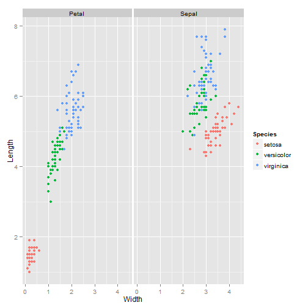

## Overview  
  
  
### The App: Interesting Facts about Iris:  

* Use the "iris" dataset  
* Provide interactive control of plotted data, and whether to display images of iris flowers  
* Here is the first few lines of the "iris" dataset:


```r
library(datasets)
head(iris)
```

```
##   Sepal.Length Sepal.Width Petal.Length Petal.Width Species
## 1          5.1         3.5          1.4         0.2  setosa
## 2          4.9         3.0          1.4         0.2  setosa
## 3          4.7         3.2          1.3         0.2  setosa
## 4          4.6         3.1          1.5         0.2  setosa
## 5          5.0         3.6          1.4         0.2  setosa
## 6          5.4         3.9          1.7         0.4  setosa
```

--- .class #id 

## Reshape data into a clean format  

* The dataset is melted so that each row contains observations for 1 part (Petal or Sepal)  


```r
head(irisdata,3)
```

```
##   Length Width  Part Species
## 1    5.1   3.5 Sepal  setosa
## 2    4.9   3.0 Sepal  setosa
## 3    4.7   3.2 Sepal  setosa
```

```r
tail(irisdata,3)
```

```
##     Length Width  Part   Species
## 298    5.2   2.0 Petal virginica
## 299    5.4   2.3 Petal virginica
## 300    5.1   1.8 Petal virginica
```

---

## Use the dropdown menu to control plot
* You can choose if you want to see the dimension plots of one iris species, or all three together  
* e.g. choose to see all three species, plot will be like:  
 

---

## Use the Checkbox to display images
* You can choose to display the images of the iris by using the checkbox  
* e.g. if selected this image will be displayed:  

![alt text][1]  

### For more information, go to the app [here](https://chenwx.shinyapps.io/IrisDisplay/)  


[1]: I:/R/IrisSlidify/setose.png "Iris Species"  


